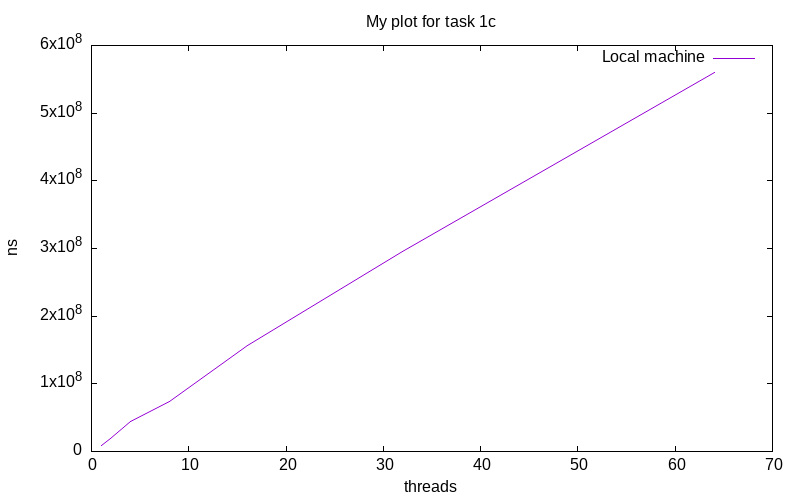

# Lab 1 - Basic Concurrency in Java

- Group X
- Persson, David and Harrison, Max

## Task 1: Simple Synchronization

### Task 1a: Race conditions

Source files:

- `task1/MainA.java` (main file)

To compile and execute:
```
javac MainA.java
java MainA
```

Q: Run the program locally with 4 threads. What results do you expect?

As there are no synchronisation mechanisms and the integer is shared, the final result will essentially by random dependent on the execution trace.

### Task 1b: Synchronized keyword
Source files:

- `task1/MainB.java` (main file)

To compile and execute:
```
javac MainB.java
java MainB
```

Q: Run the program locally with 4 threads. What results do you expect?

The synchronised keyword results in atomic read and writes, and thus the final result will be the result of 4 times 1,000,000 increments, so 4,000,000.

### Task 1c: Synchronization performance

Source files:

- `task1/MainC.java` (main file)

To compile and execute:
```
javac MainC.java
java MainC <N>
```
Where `N` is number of threads to execute with.

In figure 1, we see how the execution time scaled with the number of threads.
...



## Task 2: Guarded blocks using wait()/notify()

### Task 2a: Asynchronous sender-receiver

Source files:

- `task2/MainA.java` (main file)

To compile and execute:
```
javac MainA.java
java MainA
```
Running it several times results in different printed values.

### Task 2b: Busy-waiting receiver

Source files:

- `task2/MainB.java` (main file)

To compile and execute:
```
javac MainB.java
java MainB
```
The program only prints once all the incrementing is done, as expected.

### Task 2c: Guarded block

Source files:

- `task2/MainC.java` (main file)

To compile and execute:
```
javac MainC.java
java MainC
```

### Task 2d: Performance analysis

Source files:

- `task2/MainD.java` (main file)

To compile and execute:
```
javac MainD.java
java MainD <N>
```
where 'N' is the number of rounds to perform measurement for. This defaults to 10.

## Task 3: Producer-Consumer Buffer using Condition Variables

Source files:

- `task3/Main.java` (main file)
- `task3/Buffer.java`

To compile and execute:
```
javac Buffer.java Main.java
java Main
```

## Task 4: Counting Semaphore

## Task 5: Dining Philosophers
