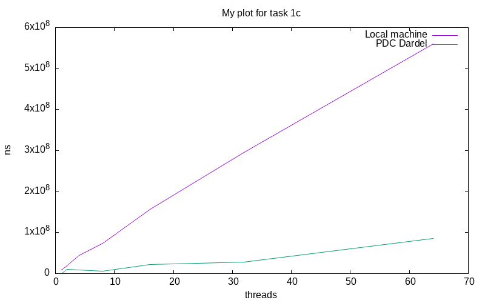

# Lab 1 - Basic Concurrency in Java

- Group "Lab 1 Group DP-MH"
- Persson, David and Harrison, Max

The code for a specific task is organised in the directory of that name.

At time of submission our PDC accounts were not working so we haven't completed that part. We are waiting on support tickets.

## Task 1: Simple Synchronization

### Task 1a: Race conditions

Source files:

- `task1/MainA.java` (main file)

To compile and execute:
```
javac MainA.java
java MainA
```

Q: Run the program locally with 4 threads. What results do you expect?

As there are no synchronisation mechanisms and the integer is shared, the final result will essentially by random dependent on the execution trace.

### Task 1b: Synchronized keyword
Source files:

- `task1/MainB.java` (main file)

To compile and execute:
```
javac MainB.java
java MainB
```

Q: Run the program locally with 4 threads. What results do you expect?

The synchronised keyword results in atomic read and writes, and thus the final result will be the result of 4 times 1,000,000 increments, so 4,000,000.

### Task 1c: Synchronization performance

Source files:

- `task1/MainC.java` (main file)

To compile and execute:
```
javac MainC.java
java MainC <N>
```
Where `N` is number of threads to execute with.

In figure 1, we see how the execution time scaled with the number of threads.
...



## Task 2: Guarded blocks using wait()/notify()

### Task 2a: Asynchronous sender-receiver

Source files:

- `task2/MainA.java` (main file)

To compile and execute:
```
javac MainA.java
java MainA
```
Running it several times results in different printed values, as expected.

### Task 2b: Busy-waiting receiver

Source files:

- `task2/MainB.java` (main file)

To compile and execute:
```
javac MainB.java
java MainB
```
The program only prints once all the incrementing is done, as expected.

### Task 2c: Guarded block

Source files:

- `task2/MainC.java` (main file)

To compile and execute:
```
javac MainC.java
java MainC
```
A while loop and try-catch block is used to prevent spurious wakeups: if a thread is woken up on error, it will just loop around until the condition is true.

### Task 2d: Performance analysis

Source files:

- `task2/MainD.java` (main file)

To compile and execute:
```
javac MainD.java
java MainD <N>
```
where 'N' is the number of rounds to perform measurement for. This defaults to 10.

The busy wait seems to be much faster than the guarded block in this case. This is likely due to the overhead of creating the guards for the block.

## Task 3: Producer-Consumer Buffer using Condition Variables

Source files:

- `task3/Main.java` (main file)
- `task3/Buffer.java`

To compile and execute:
```
javac Buffer.java Main.java
java Main
```

The buffer functions as expected with the integers removed in the order they were supplied. The threads gracefully exit on completion.

## Task 4: Counting Semaphore


## Task 5: Dining Philosophers

### Task 5a: Modelling dining philosophers

Source files:

- `task5/MainA.java`

To compile and execute:
```
javac MainA.java
java MainA <N>
```
where N is the number of philosophers, defaults to 5.

Q: Your simulation should deadlock. Observer and record the situations under which a deadlock is reached.

Deadlock occurs when every philosopher has grabbed one of their chopsticks at the same time. As each philosopher still wants to grab the chopstick to the right of them they are stuck. No philsopher is able to let go when they get in this position, so the entire table is waiting on each other.

Q: Test with more philosphers, does it deadlock faster?
More philosophers makes the chain of grabbing more likely to occur, so it should deadlock faster.

### Task 5b: Debugging

The tool `jstack` is provided by the Java environment. We can use `jps` to find the current Java threads with process IDs, and then run `jstack -l ID` to get a thread dump. 

Using this in our situation we can see that the running threads are all waiting on the synchronised lock object to be true.

### Task 5c: Solution to the dining philosophers

Source files:

- `task5/MainC.java`

To compile and execute:
```
javac MainC.java
java MainC <N>
```
where N is the number of philosophers, defaults to 5.

The only shared variables of the philosophers are the chopsticks shared by them. The simplest way to prevent deadlock is just to break the symmetry of the chopstick selection. This can be done by making the last philosopher pick up their chopsticks in the reverse order. This means that the last philosopher will only be able to pick up their firsk chopstick (chopstick 1) when it hasn't already been picked up by philosopher 1. We also prevent starvation because all the philosophers wait on locks, and the rentrant lock in Java will supply lock access in order of approach by threads.
