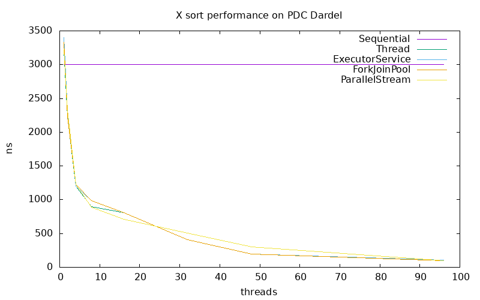

# Lab 2 - Java Parallel Programming and Sorting Algorithms
- Group 11
- Persson, David and Harrison, Max

## Task 1: Sequential Sort
Source files:

- `SequentialSort.java`

We chose to implement MergeSort. For the sequential version this is implemented top-down where the array is recursively halved into smaller chunks, sorted, and then merged back together. The base case is a chunk of one element which is already sorted.

## Task 2: Amdahl's Law

Our Amdahl's law ...

Here is a plot of our version of Amdahl's law ...

We see that ...

## Task 3: ExecutorServiceSort

Source files:

- `ExecutorServiceSort.java`

Java's executor service allows us to create a fixed pool of threads and then assign jobs for the pool to execute. In this case its simpler to do bottom-up merge sort where we initally split the list into single elements and then recursively merge successive sized chunks until the entire list is sorted. As there is a base level of overhead for distributing tasks, we initially break up the list into size 16 chunks which are sequentially sorted by the pool, and then normal parallel merge sort is executed. We implicitly create a barrier at each loop by destroying the pool for that loop - this is less efficient than if we maintained the pool and managed the threads with some sort of lock system.

## Task 4: ForkJoinPoolSort

Source files:

- `ForkJoinPoolSort.java`

A ForkJoinPool is a type of executor service that is specifically designed for the divide-and-conquer nature of merge sort, so this mechanism is much more natural for our setting. We can return to top-down merge sort: a thread is handed a list, splits it in two, forks a thread to sort the left sublist, and then merges back the results. This is exactly what the mechanism is designed to do so it should be fairly efficient. Too much overhead we initially sequentially sort chunks of size 16.

## Task 5: ParallelStreamSort

Source files:

- `ForkJoinPoolSort.java`

To implement merge sort using parallel streams, we loop through several different chunk sizes until we have covered the entire list. For each chunk size we generate a stream of merge operations, which can be executed in parallel by adding the `.parallel()` method to the stream. Again to avoid too much overhead we initially sequentially sort chunks of size 16.

## Task 6: Performance measurements with PDC

We decided to sort 10,000,000 integers ...

We see that ...
