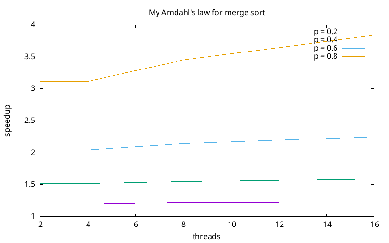
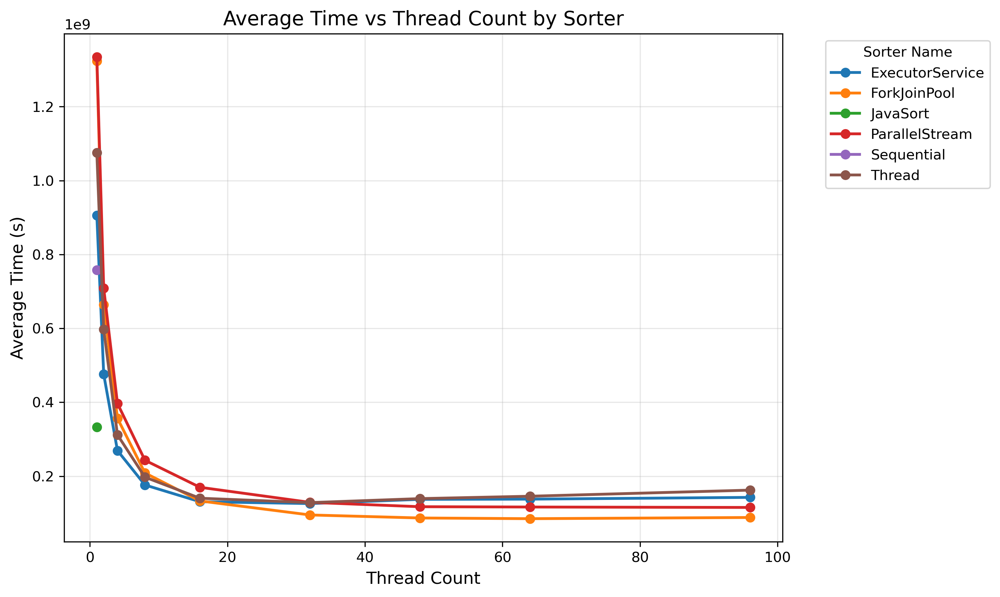

# Lab 2 - Java Parallel Programming and Sorting Algorithms
- Group 11
- Persson, David and Harrison, Max

## Task 1: Sequential Sort
Source files:

- `SequentialSort.java`

We chose to implement MergeSort. For the sequential version this is implemented top-down where the array is recursively halved into smaller chunks, sorted, and then merged back together. The base case is a chunk of one element which is already sorted.

## Task 2: Amdahl's Law

Amdahl's law assumes that the parallelisable part of a workload can be indefinitely split between threads, but merge sort inherently has a "sequential" nature to its algorithm: the last merge involves one thread merging each half of the list. There is no way around this final step, and as the number of threads increase this final step becomes a bigger proportion of the workload. In addition, as the number of threads increase there is increased communication overhead between the threads. We thus can say that there isn't a linear performance gain when adding more threads as in general Amdahl's law - the performance gain from each additional thread decreases marginally as $N$ increases. We thus add a logarithmic factor to penalise additional threads:
$$
    \text{Speedup}_n = \frac{1}{(1-p) + p \cdot \frac{\log (N)}{N}}
$$

A plot of our version of Amdahl's law can be seen in Figure 1.

We see that for $p<0.8$ there isn't a huge speedup gained from adding additional threads. This seems overly pessimistic but it reflects the difficult nature of merge sort.

## Task 3: ExecutorServiceSort

Source files:

- `ExecutorServiceSort.java`

Java's executor service allows us to create a fixed pool of threads and then assign jobs for the pool to execute. In this case its simpler to do bottom-up merge sort where we initally split the list into single elements and then recursively merge successive sized chunks until the entire list is sorted. As there is a base level of overhead for distributing tasks, we initially break up the list into size 16 chunks which are sequentially sorted by the pool, and then normal parallel merge sort is executed. We implicitly create a barrier at each loop by destroying the pool for that loop - this is less efficient than if we maintained the pool and managed the threads with some sort of lock system.

## Task 4: ForkJoinPoolSort

Source files:

- `ForkJoinPoolSort.java`

A ForkJoinPool is a type of executor service that is specifically designed for the divide-and-conquer nature of merge sort, so this mechanism is much more natural for our setting. We can return to top-down merge sort: a thread is handed a list, splits it in two, forks a thread to sort the left sublist, and then merges back the results. This is exactly what the mechanism is designed to do so it should be fairly efficient. Too much overhead we initially sequentially sort chunks of size 16.

## Task 5: ParallelStreamSort

Source files:

- `ForkJoinPoolSort.java`

To implement merge sort using parallel streams, we loop through several different chunk sizes until we have covered the entire list. For each chunk size we generate a stream of merge operations, which can be executed in parallel by adding the `.parallel()` method to the stream. Again to avoid too much overhead we initially sequentially sort chunks of size 16.

## Task 6: Performance measurements with PDC

To measure our implementations we used the folowing parameters:

- Array size: 10,000,000
- Warm up rounds: 50
- Measurement rounds: 50
- Seed for RNG: 42

We tested each of the sorters with the desired thread ranges, resulting in the following plot:

As expected, the single thread sequential sort takes longer than the native Java sort implementation. Most of the parallel sorts take less time than the single thread sorts. ExecutorService had a unintuitive pattern: as thread count increased initially, execution time dropped as expected. However for larger thread counts the execution time went up. We're not sure if this is to do with the specific implementation or something about the ExectorService framework that results in large allocation overhead for larger core counts. ForkJoinPool ran the fastest for larger thread counts. This matches the intuition that this mechanism perfectly matches the divide-and-conquer nature of merge sort and thus the compiler can probably optimise most successfully under this paradigm using the framework.

ForkJoinPool was the easiest to implement as the framework handles all of the allocation and joining logic for you, and also was easy to reason about. It matched this use case perfectly, so is our preferred method for such tasks. The ParallelStream method also resulted in surprisingly good performance and was interesting to reason about, so it seems to be a good option for more general tasks.
Using Thread class directly was the hardest to implement - we had to handle all the allocation and joining logic manually. It did perform about as well as the ForkJoinPool and ParallelStream frameworks.

**UPDATED**:
We now see the expected pattern across all implementations. As the number of threads increase, the sorters execution time rapidly decreases initially and then flattens out once a certain number of thresholds is reached. At this point adding threads does not affect performance (and for some sorters seems to make it slightly slower). The parallel sorts also take longer than the purely sequential sorts for low thread counts (e.g. 2) due to the overhead of handling the additional threads.