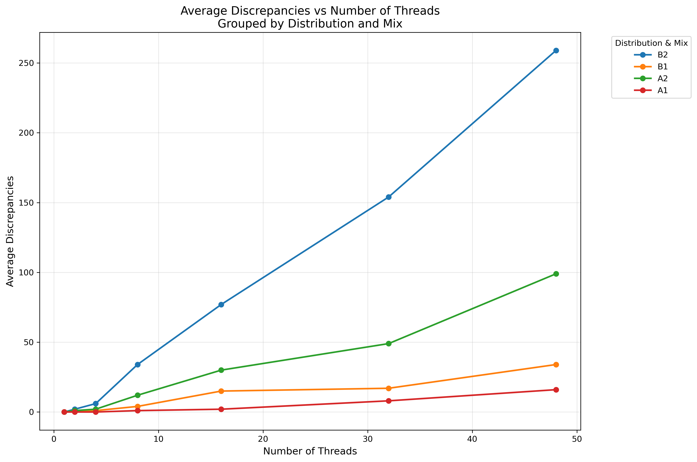

# Lab 3 - Validating Linearisability of Lock-free Skiplists

- Group M.
- Harrison, Max

# 1. Measuring execution time

## 1.1 Measurement program

On my local machine, the program performed as in Figure 1.

## 1.2 PDC experiments

The average execution time across the specified range of threads is plotted in Figure 2.

There are three key observations in the plot:

1) Across all distributions and mixes, adding additional threads increases the average execution time. If we had perfect parallelism, then increasing the number of threads shouldn't increase the average execution time as each thread is allocated the same amount of work and the work increases linearly with the number of threads. However, this is impossible in practice so we have some overhead in work allocation and thread communciation. This aligns with our intuition.
2) The normal distribution cases ran faster than the uniform distribution case. This seems to contradict that the normal distribution is implemented via repeated sampling from the unifrom distribution, so we would expect the uniform sampling to run faster.
3) The mixes without contains (1:1:0) ran longer than the mixes dominated by contains calls (1:1:8). This is expected as `contains()` is a simpler operation than the add/remove methods.

# 2. Identify and validate linearization points

## 2.1 Identify linearization points

### The `find()` method

The linearisation points of the `find()` method occur when the `curr` reference at the bottom-level list is set (at lines 165, 171 or 175) for the last time before the `find()` call's success or failure is determined (on line 185). As the abstract set is defined by the bottom-level list, the item is in the set if and only if the `curr` reference points to a node with the key's value.

To capture this we need to log at lines 165, 171, and 175 (where `curr` is updated during traversal) but only commit the log entry when we reach line 185 and determine the final return value. Each time `curr` advances at the bottom level we record the state, and when we determine the return value we emit the log entry corresponding to the last bottom-level update of `curr`.

### The `contains()` method

As the `contains()` method is essentially a simpler version of the `find()` method without snipping or neighbour locating, we can just use the same linearisation points as the `find()` method. This is when the `curr` reference at the bottom-level list is set (at lines 136, 140, 145) for the last time before the `contains()` call's success or failure is determined (on line 151).

To capture this we use the same approach as the `find()` method: each time `curr` advances at the bottom level we record the state, and when we determine the return value we emit the log entry corresponding to the last bottom-level update of `curr`.

### The `add()` method

The `add()` method calls `find()` to determine whether the key is already in the set or not. If the `find()` call returns `true` (meaning that an unmarked node with the key was found in the bottom list), then the `add()` is unsuccessful and returns `false`. The unsuccessful `add()` then has the same linearisation point as the successful `find()` (called by `add()` at line 64), specifically when the `find()` method sets the `curr` reference for the bottom-level list.

If the `find()` call returns `false` (meaning that no unmarked node with that key was found in the bottom list), a new node is created with a randomly chosen top level. The node's successors are filled in and unmarked. Then, the crucial point is calling `compareAndSet()` on the previous bottom level node's `next` reference (line 75). This both validates that the previous node is still the previous node (as we expect to see the successor node found by `find()`) and inserts the new node into the bottom list (thus inserting the key into the abstract set). If the call succeeds, then the `add()` has successfully inserted the node and thus this is the linearisation point. If the call fails, then the previous/successor nodes have changed and we restart by calling `find()` again.

To capture this we use a hybrid approach:

- For unsuccessful adds (when `find()` returns `true`): propagate the linearisation point from the `find()` method to the `add()` method and emit it when returning false at line 65.
- For successful adds: log immediately after the successful `compareAndSet()` at line 75. This CAS operation and represents the exact moment the new node becomes part of the abstract set. We can wrap this line with logging that only executes when the CAS returns true, capturing the linearisation point at the instant of successful insertion.

### The `remove()` method

The `remove()` method calls `find()` to determine whether the key is actually in the set or not. If the `find()` call returns `false` (meaning that no unmarked node with the key was found in the bottom list), then the `remove()` is unsuccessful and returns `false`. The unsuccessful `remove()` then has the same linearisation point as the unsuccessful `find()` (called by `remove()` at line 99), specifically when the `find()` method sets the `curr` reference for the bottom-level list.

If the `find()` call returns `true` (meaning that an unmarked node was found in the bottom list), the unmarked node's links are marked (from the top down). Once all but the bottom link have been marked, the bottom link is attempted to be marked (line 115). If this marking is successful, then this is the linearisation point of the `remove()` method - the key has been logically deleted from the set. 

If the marking is unsuccessful then we have two possible cases:

1) The mark bit is still set: in this case then some other thread concurrently marked the bottom-level link. As this must have occurred between the initial `find()` call (which found the bottom link unmarked) and now, we can use the other thread's marking as the linearisation point.
2) The mark bit is unset: the `next` node must have changed concurrently (the successor node was removed by a `find()` call) while the upper level links were being marked. The `remove()` method can then just retry with the new `next` reference, which puts us back in one of the above cases.

To capture this, we use a multi-case approach:

- For unsuccessful removes (when `find()` returns `false`): propagate the linearisation point from `find()` and emit it when returning `false` at line 100.
- For successful removes (when `iMarkedIt` is `true` at line 116): log immediately after the successful `compareAndSet()` at line 115, as this is when the node is logically deleted from the set.
- For the case where `find()` returns `true` but `iMarkedIt` is `false` (line 118): we need to check the `marked[0]` value after the failed CAS. If `marked[0]` is true (case 1), another thread successfully marked the node concurrently. We capture this by replaying the winning thread's CAS operation - we need a global mechanism  where the thread that successfully marks the bottom-level link records the linearisation point. If `marked[0]` is `false` (case 2), we retry the loop, eventually reaching one of the other cases. This requires tracking the node identity across retries to ensure we attribute the linearisation point correctly when the removal eventually succeeds.

## 2.2 Develop a validation method

The implementation of the validation method can be seen in `src/Log.java`. The log entries are sorted by timestamp (so the sequential hash set is replayed in the correct order), and the entries are checked against the sequential hash set to count the number of discrenpancies.

## 2.3. Locked time sampling

The global lock list is implemented in `src/GlobalLockSkipList.java`. The list now has a global ReentrantLock which threads grab before executing the linearisation points identified in 2.1 and time sampling. To share linearisation timestamps between threads, nodes now have `removalTimestamp` field which is updated during node removal in case of any concurrent removals.

On the measurements using my local machine, the global lock approach actually results in 0 log discrepancies so the implementation seems to be quite accurate. The local performance data is plotted in Figure 3.

The global lock list actually performs significantly faster than the lock-free implementation for these low thread counts. I suspect this is due to a large degree of cache contention generated by multiple threads calling CAS at the same time. While the global lock implementation introduces additional logging overhead, the reduction in bus contention actually results in a significance performance increase. This is likely to not scale well however for higher thread counts (like those available on PDC). I'm also not sure why the 8-thread case halved the execution time for B2.

## 2.4. Lock-free time sampling with local log

The local log approach is implemented in `src/LocalLogSkipList.java`. The list no longer has a global lock, instead each thread is allocated an ArrayList to hold the log entries. Now threads just sample directly without any synchronisation mechanisms. When `getLog()` is called to validate the log, the individual thread logs are merged into one big ArrayList that comprises the overall log. The local performance data is plotted in Figure 4.

The local log approach performs about as well as the lock-free implementation with no validation. This is again likely due to the write intereference caused by several threads calling CAS on the same variables, causing a large amount of bus traffic.

The number of discrepancies across the various cases and thread counts is shown in Figure 5. The mixes with no `contains()` calls actually contain no discrepancies. The mixes with `contains()` calls have a linear relationship with the number of threads involved in the execution. More threads results in more discrepancies, as one would expect as there are more opportunities for threads to call `System.nanoTime()` concurrently.

## 2.5. Lock-free time sampling with global Log

The global log approach is implemented in `src/GlobalLogSkipList.java`. Instead of having individual ArrayLists for each thread, there is a single global lock-free log that threads submit their log entries to. This global log is instantiated using a `ConcurrentLinkedQueue` from `java.util.concurrent` as this "supplies an efficient scalable thread-safe non-blocking FIFO queue" which is sufficient for our purposes here. The queue is unbounded, so the `add()` method will never throw an execption. 

The JMM guarantees that all actions in a thread before calling `add()` happen-before the element becomes visible to other threads interacting with the queue (e.g. calling `poll()` or iterating over the queue). Since `add()` is lock-free and the queue uses internal CAS operations, we're not introducing locks or additional blocking synchronisation. The queue's internal implementation uses volatile fields and CAS, which are already part of the JMM's synchronisation primitives. When a thread calls `getLog()`, it sees all entries that were successfully added via `add()` before the call, thanks to the happens-before guarantees of the queue's internal synchronisation. 

## 2.6. PDC experiments

For the individual log case (2.4), the execution time performance is shown in Figure 6 and the average discrepancy counts are shown in Figure 7.

For the global log case (2.5), the execution time performance is shown in Figure 8 and the average discrepancy counts are shown in Figure 9.

## 2.7. Extra task: global log from scratch

The custom data structure is implemented in `src/LockFreeQueue.java`. This is heavily drawn from the lock free queue structure in 10.5 of HSLS. I have added two methods `toArray()` and `clear()` used for the logging validation. The execution time performance is shown in Figure 10.

